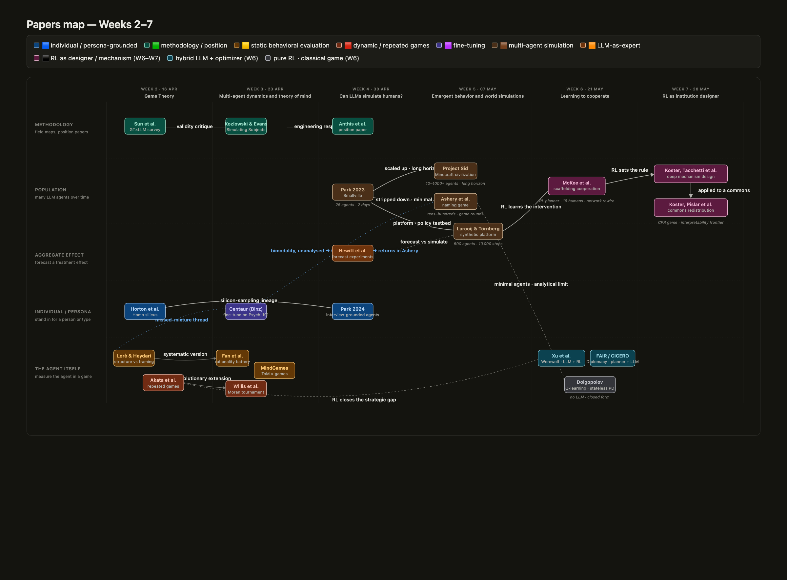

# Papers map — Weeks 2–7

*Every paper in the seminar, placed on one map — week across, methodological altitude down, colour by category. **[▶ Open the interactive version →](https://htmlpreview.github.io/?https://github.com/carinahausladen/konstanz-dynamic-social-behavior/blob/main/Topics/papers_map_w2-w7.html)***

Companion-book chapters live in this folder (`02.md`–`07.md`).
